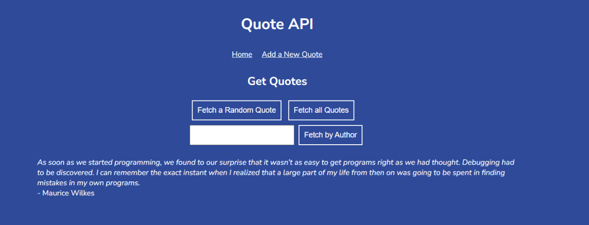
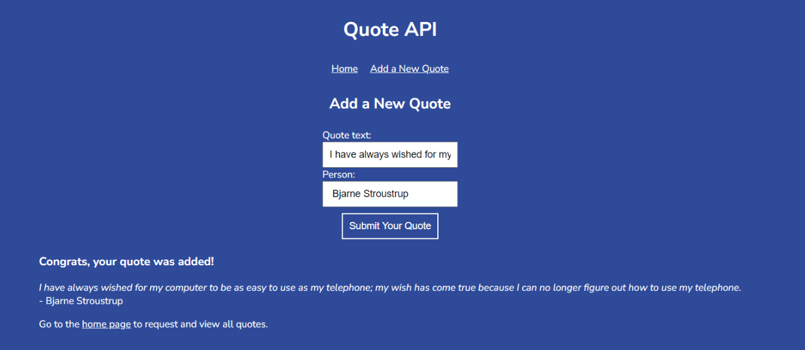

Quote API
===
 A small Express.js web API to store and serve different quotes about computers, coding, and technology

## Install & Dependence
- NodeJS
- ExpressJS
- JavaScript ES6


## Features
- Fetch a Random Quote
- Fetch all Quotes
- Fetch by Author
- Add a New Quote
- Update a quote
- Delete a quote
## Start
- Start server in node:
  ```
  node server.js
  ```



===
